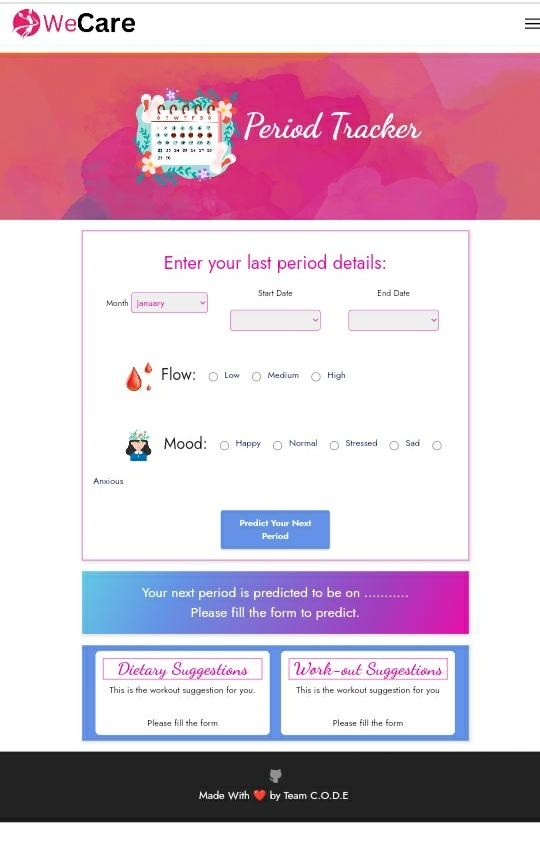
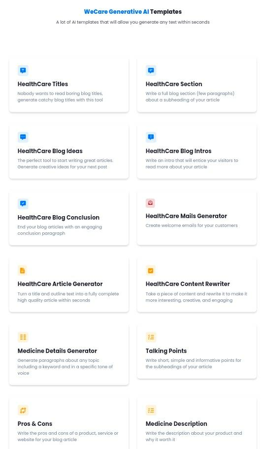
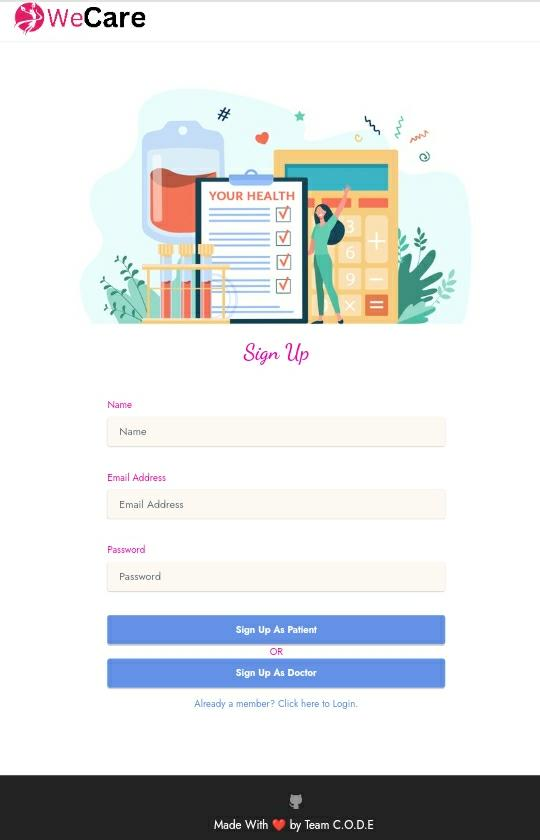
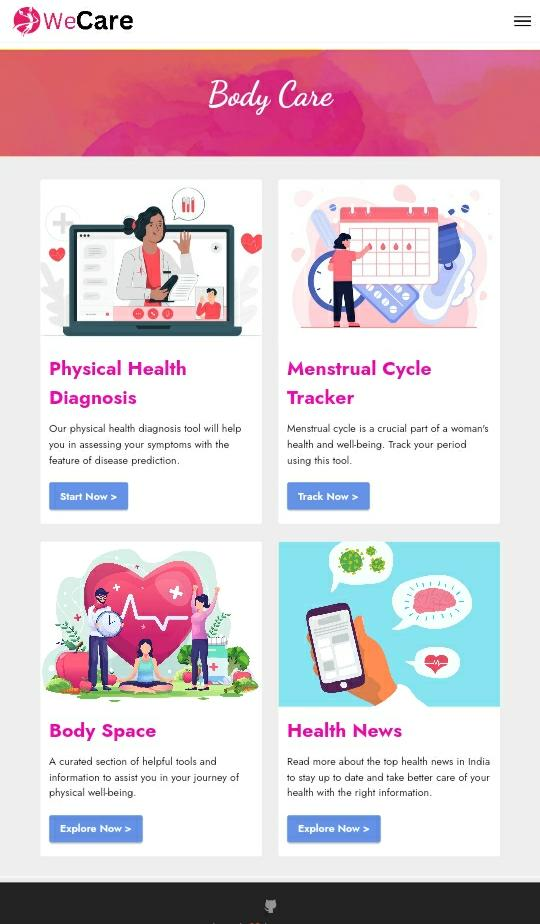

# WeCare Generative AL
The goal is to leverage AI technologies to streamline the content creation process and provide a personalized experience to readers while maintaining the integrity and authenticity of the publishing brand.

## Overview

The goal of this project is to build an impressive tool that utilizes generative AI to generate content while maintaining the style and tone of previously written content. 

The tool will take a title/headline as input and generate relevant and meaningful content that aligns with the writing style of the provided content.

## Problem Statement :
Develop an innovative Generative AI-powered Content Generation Tool that can automate content creation while preserving the style and tone of previously written content. The tool should take a title or headline as input and generate coherent and relevant content that aligns with the provided writing style. The key components of the tool will include a robust generative AI model, fine-tuning for style and tone preservation, contextual understanding of the input, user-friendly interface, and a focus on maintaining high quality and accuracy in content generation.

The tool should be capable of understanding the nuances of existing content and using this knowledge to generate new content that matches the writing style.
It should efficiently process diverse datasets to train the generative AI model and perform fine-tuning on a domain-specific corpus to capture specific writing styles accurately.
The content generation process should take into account the context provided in the input title or headline, making the output meaningful and relevant. To ensure user satisfaction, the tool should be equipped with an intuitive and user-friendly interface, allowing users to input their titles and receive well-crafted content in a readable format. 
Continuous optimization and improvement through user feedback should be a priority to achieve a high level of accuracy and quality in content generation.

## Objectives :  	:notebook_with_decorative_cover:
- Improve content quality by supporting content creators.
- Provide Creator tools to make blogs & articles.
- Automate content generation process.
- Perform Plagiarism & Fact Check.
- Enhance reader engagement through personalized content.

# Solution  	:key:

## Product 
1. Content Creator Web App + Android App
2. AI Tool Kit For Content Creation
3. User App

## Challenges :  	:notebook_with_decorative_cover:
- Balancing AI assistance with content creators' creative input.
- Maintaining content quality and authenticity in automated processes.
- Integrating AI into existing content creation workflows.
- Data privacy and ethical considerations.
- Accurate understanding of user preferences and interests.
- Monitoring and evaluating AI performance.

# Installation of Project

### Prerequisite
PHP v8.1,PHP Mbstring Extension,PHP PDO Extension,PHP FileInfo Extension,PHP JSON Extension,PHP CURL Extension,PHP ZipArchive Extension,PHP symlink() function,PHP shell_exec() function,PHP file_get_contents() function

1. Setup Wamp or Xampp Server in case of Windows or LAMP Server in case of Linux or MAMP in case of Mac, Here I have used Cpanel beacause it is easy to setup in cpanel.

2. Zip and upload only the contents of github Project to the root directory of your hosting server. Ex: /var/www/html/ or /home/username/public_html or whatever is the root folder of your domain/subdomain which will make it reachable as follows: http://yourwebsitename/ like in my case https://teamcode.tech
3. After uploading all files and making sure that domain name has proper path set, create Mysql database and proper user in case if you don't already have one, to access this database. You can either create manually via your phpMyAdmin panel or use phpMyAdmin Wizard in your cPanel to create one
4. Now open .env.example file in file manager and add the following details:-
   APP_URL=
   APP_EMAIL=
   DB_CONNECTION=mysql
   DB_HOST=localhost
   DB_PORT=3306
   DB_DATABASE=
   DB_USERNAME=
   DB_PASSWORD=
   OPENAI_SECRET_KEY= Chatgpt api key
  finalyy change .env.example to .env and then save.
5. Finally Import .sql content into phymyadmin of cpanel
6. Boom!! Now you can open your Project with credentials admin@example.com and admin12345

## Tools and Technology Used:

## Business Model / StartUp Potential  	:moneybag:

1. Freemium Model:
 Offer a free version of the content generation tool with basic features and limited usage. Users can access the tool for generating a certain number of content pieces per day or week. To unlock advanced features, higher content generation limits, and improved accuracy, users can subscribe to a premium version with a monthly or yearly subscription fee.

2. Pay-per-Use Model:
Implement a pay-per-use model where users pay a small fee for each content generation request. This approach allows users to pay only for the content they need, making it cost-effective for occasional users or small-scale content generation requirements.

3. Subscription Tiers:
Introduce multiple subscription tiers catering to different user needs. Each tier can offer various benefits such as increased content generation limits, faster processing times, priority customer support, and access to exclusive features. Users can choose a subscription level that aligns with their content creation needs and budget.

4. Enterprise Licensing:
Target businesses, agencies, and content marketing teams with a separate enterprise licensing model. Offer custom pricing and tailored solutions for large-scale content generation needs. This could include white-labeling the tool, providing API access for seamless integration into existing platforms, and personalized support for enterprise clients.

5. API Access and Integration:
Offer an API (Application Programming Interface) for developers and businesses to integrate the content generation tool into their own applications, websites, or platforms. Charge a usage-based fee for API access, allowing developers to incorporate content generation functionality into their products.

6. Data Insights and Analytics:
Provide advanced data insights and analytics as an add-on service. Users can opt to receive detailed reports on content performance, engagement metrics, and audience feedback to refine their content strategies. This data-driven service can be offered as a premium feature or as part of an enhanced subscription tier.

7. Sponsored Content:
Partner with brands or businesses interested in promoting their products or services through generated content. Offer sponsored content slots within the generated output, where advertisers can insert their messages in a non-intrusive manner. This can provide an additional revenue stream while offering relevant content to users.

8. Content Creation Services:
Offer content creation services as an additional service to users who require professional-grade content for marketing campaigns or other purposes. Users can request custom content generated by human writers trained to mimic specific writing styles and tones.

9. Affiliate Marketing:
Collaborate with relevant platforms, marketplaces, or content creation tools for mutual promotion. Implement affiliate marketing programs where affiliates earn a commission for referring users who sign up for the content generation tool.

10. In-App Purchases:
Offer in-app purchases for additional features, templates, or content styles that users can use to customize their generated content. These microtransactions can provide users with more options while generating additional revenue for the tool.

### ScreenShots of WeCare
<pre>
     
</pre>
### Contributors

- Aman Gupta
- Shashank Kumar
- Richa Agrawal
- Prarthana Agrawal

